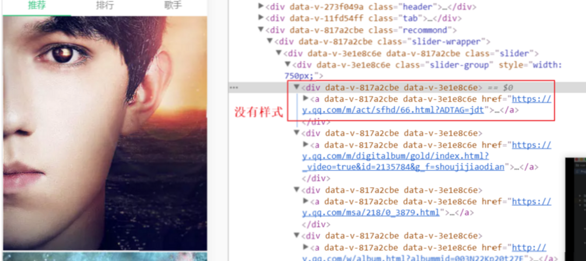
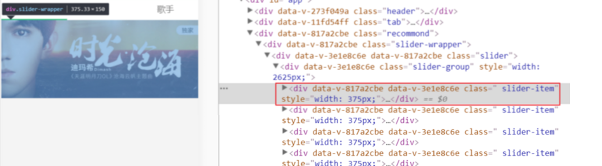
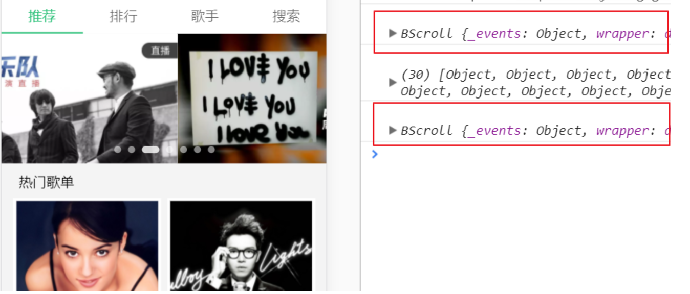
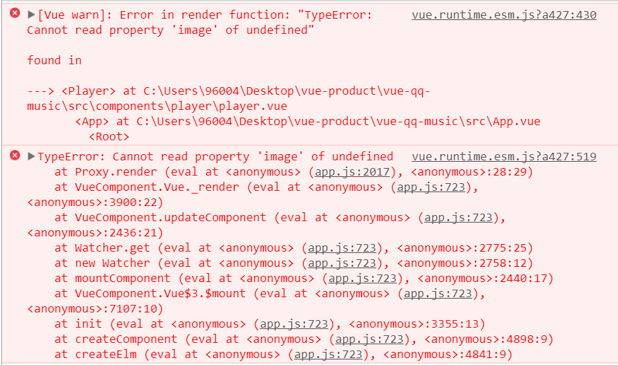

# NingMeng-music日志
# demo 展示

## 结构
├─server <br>
├─src<br>
│  ├─api<br>
│  ├─base<br>
│  │  ├─listview<br>
│  │  ├─loading<br>
│  │  ├─pop-box<br>
│  │  ├─progress-bar<br>
│  │  ├─scroll<br>
│  │  ├─search-bar<br>
│  │  ├─slider<br>
│  │  └─song-list<br>
│  ├─common<br>
│  │  ├─fonts<br>
│  │  ├─image<br>
│  │  ├─js<br>
│  │  └─style<br>
│  ├─components<br>
│  │  ├─disc<br>
│  │  ├─m-header<br>
│  │  ├─music-list<br>
│  │  ├─player<br>
│  │  ├─rank<br>
│  │  ├─rank-detail<br>
│  │  ├─recommond<br>
│  │  ├─search<br>
│  │  ├─singer<br>
│  │  ├─singer-detial<br>
│  │  ├─suggest<br>
│  │  ├─tab<br>
│  │  └─user<br>
│  ├─router<br>
│  └─store<br>

## 插件

```
    "axios": "^0.16.2",
    "better-scroll": "^0.3.4",
    "body-parser": "^1.17.2",
    "connect-mongo": "^1.3.2",
    "express-session": "^1.15.4",
    "jsonp": "^0.2.1",
    "mongoose": "^4.11.5",
    "session": "^0.1.0",
    "stylus": "^0.54.5",
    "stylus-loader": "^3.0.1",
    "vue-lazyload": "^1.0.6",
    "vue-scroller": "^2.2.1",
    "vuex": "^2.3.1"
```
## 待优化
### (2017-8-4)
- scroller路由切换问题,上拉刷新提示问题,noMoreData提示问题,回到顶部问题
- 用户登录,用户密码格式验证format函数,根据用户名总动生成头像,用户输入时虚拟键盘问题,记录用户登录状态 session
- play组件添加歌词功能
- 搜索列表增加 歌手项

## 问题解决
### 图片挂载问题
> 设置了图片的样式和slider的宽度以后 图片的大小没有变化还是很大  

- 在slider组件中,我是在mounted这个钩子函数中执行setSliderWidth这个函数设置轮播总长度和给slider-item添加class
- 而在recommond中我获取数据是在created这个初始化完成的钩子中获取,在created时候获取是为了保证后面挂载的正常进行,但是其实获取数据的过程是需要时间的
- 也就是说在我进行mounted这一步的时候,我的数据可能还没get回来,slider里面并没有元素,即使数据获取回来后,mouted已经结束,所以样式未添加上
- 解决 在slider标签增加 v-if="recommondData.length" 数据请求成功后再进行挂载


如图:



### 歌单Scroll组件的滚动问题

这个问题真的是无语

- 第一使用浏览器原本的scroll来滚动,可以滚,但是体验不好
- 第二用了vue-scroll组件,滚动完美,但是有一个问题,就是我里面放入了轮播图,当我再去滑动轮播图的时候,手指完全水平,不会有问题,如果在滑动也就是touchmove过程中y轴move的距离稍微大一点点就会导致页面向上滑动,也就是我只是单纯想滑动轮播图,会造成页面轮播图一起动,体验同样不好....看vue-scroll文档没找到调试的api
- 还是用了better-scroll,自己写了scroll组件,然后不能滚动,找问题找了一个多小时,样式,数据绑定都检查过,没问题,渲染正常,但就是不滚动,后来发现,scroll组件的slot用来将recommend渲染的数据插入,从而撑开scroller 来进行滚动,然后我在获取数据后输出数据,scrollInit后打印组件状态,如下图:



可以看到,scrollInit的时机是先于数据获取的,所以scroll没有被数据撑开,就不能滚动,第三行是我在scroll标签上绑了dissList,并watch他的状态,如果变化就调用scroll的refresh方法,然后就能撑开并滚动了

#### 总结
这个问题和上个问题一样,因为数据get的过程是个异步过程,所以在挂载组件的时候要做相应处理

### player页面image问题


我在app中引入了play这个组件,组件默认不显示,在singer-detial中点击了相应的歌曲,然后sing-list将点击的歌曲信息发射出去,music-list捕获信息,然后通过vuex的actions来对state进行一系列的修改,其中有对currentIndex(当前点击的歌曲的index)的更新,然后通过在player页面getters获取计算出的currentSong,player页面中的image依赖currentSong,这里报的错误显而易见是说刚开始的currentSong是undefined
我开始找问题的时候,首先考虑的是,playingList被填充后才会显示player页面,但我项目开始run就报这个错了,这里我可能跟路由有点混,这里play组件挂在App上,不显示并不代表他没挂载,路由才是你切换到对应路径才开始挂载,切换到其他路径当前路由组件会销毁
#### test: 
  我在palyer组件created钩子函数console.log(1),singer路由组件created钩子函数console.log(2),
  结果很明显,开始输出1,切到singer输出2
  
  然后我就去看定义在getters里面的currentSong,在这里我对所有state状态都进行了代理,getters是可以对state进行运算的,这里currentSong就是通过currentIndex计算出,然后我发现了问题...我是给currentSong 计算后的数据,可是我没有考虑当currentIndex也不存在时,currentSong的值...默认不存在给一个{}就好了
#### 总结
 当getters里面的变量是通过其他state计算得出的时候,根据你使用的状态,要赋予默认值,这里和node里面从服务器读数据类似,如果我读到的是个空,我可以给他赋个[]
 
### 搜索页上拉刷新
 我是用的vue-scroller组件自带上拉刷新功能,需要绑定一个inifinite事件,这个事件判断还有没有新的数据,有新的就添加进去
 这里我用了扩展运算符,将新旧数组展开到一个新数组,再渲染到页面,因为是使用的qq音乐的api,所以对每次获取的数据要做处理,给api传的data中有page和prepage两个参数,每次上拉时对这两个参数进行重新计算,因为每一页获取的歌曲数是10条,所以我用已经获取的搜索结果length除以10,来和page比较,得出page和prepage
 然后写完之后调试,第一个问题出现了,当我修改query(搜索的值)时,上一次搜索的数据还在,这个一看就明白了,所以我在watch里面对搜索list结果进行了清空
 接着调试上拉刷新正常,但是同样是在修改搜索值时,显示的内容感觉丢失了,就是本来搜周杰伦应该哗哗哗的刷新个没完,但是我刷了几回就没有了,仔细想想,可能同样是变量的初始化问题,我在改变query后page应该从1开始计算,如果不清空就会在上次搜索基础上累加,所以对page和prepage进行了初始化,ok
 
 ### fastclick input框点击不能正常focus
 
 我来先来说说点击穿透是个什么玩意儿
 - 举个栗子,比如我现在有两个页面,A和B,两个页面各有一个按钮,页面叠在一起,A在上层,且两个按钮btn1和btn2位置一样, 点击btn1会让A隐藏B页面显示,但是因为在移动端touch时间有300ms的延迟(safari的双击事件决定),所以当btn1的touch时间触发,A隐藏,300ms之后触发click事件,此时显示的是B,所以相同位置的btn2的点击事件触发
 - 移动端touch事件都是触发click事件过程: touchstart->touchmove->touchend->mousedown->mouseup->click
 - 真是因为这种机制导致点击穿透
 
 我在项目中使用fastclick后,有个bug,input框的点击获取焦点,变得迟钝,点击事件变长才能获取焦点,然后咋办,谷歌呗,结果是fastclick类似的bug很多,具体解决方案,我们来看一下源码中怎么做的处理
 ```javascript
  // Case 1: If the touch started a while ago (best guess is 100ms based on tests for issue #36) then focus will be triggered anyway. Return early and unset the target element reference so that the subsequent click will be allowed through.
  			// Case 2: Without this exception for input elements tapped when the document is contained in an iframe, then any inputted text won't be visible even though the value attribute is updated as the user types (issue #37).
  			if ((event.timeStamp - trackingClickStart) > 100 || (deviceIsIOS && window.top !== window && targetTagName === 'input')) {
  				this.targetElement = null;
  				return false;
  			}
  
  			this.focus(targetElement);
  			this.sendClick(targetElement, event);
  
  			// Select elements need the event to go through on iOS 4, otherwise the selector menu won't open.
  			// Also this breaks opening selects when VoiceOver is active on iOS6, iOS7 (and possibly others)
  			if (!deviceIsIOS || targetTagName !== 'select') {
  				this.targetElement = null;
  				event.preventDefault();
  			}
  
  			return false;
  		}

```
 大概意思就是如果我的点击时间大于100ms,不会触发this.focus,而是直接触发原生click事件,如果小于100时由于e.preventDefault()阻止默认行为,focus事件未触发,如果想触发我们需要对代码就行修改
 ```javascript
  if (!deviceIsIOS || targetTagName !== 'select' && TargetTagName !== 'input') {
            this.targetElement = null;
            event.preventDefault();
          }
```
是input的时候不进行阻止,问题就解决了

解决点击穿透的方法有很多,这里做一下总结
1. fastclick
2. 在下层元素添加pointer-events:none禁止点击事件,300ms后恢复
3. 给上层元素消失添加动画,可以是opacity慢慢置为0,动画时间为300ms;
4. 在两层元素之间添加一个遮挡层,点击上层300ms以后遮挡层消失

### 最近播放历史的问题
 新增了palyHistory的state,记录已经播放过的歌曲
 

